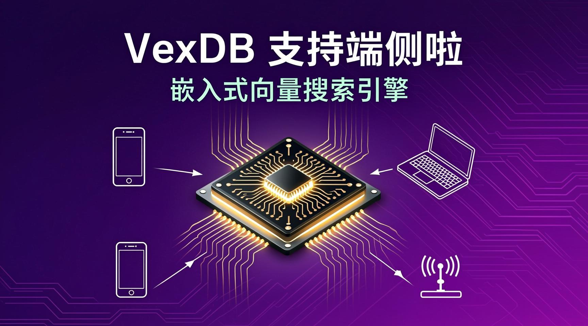
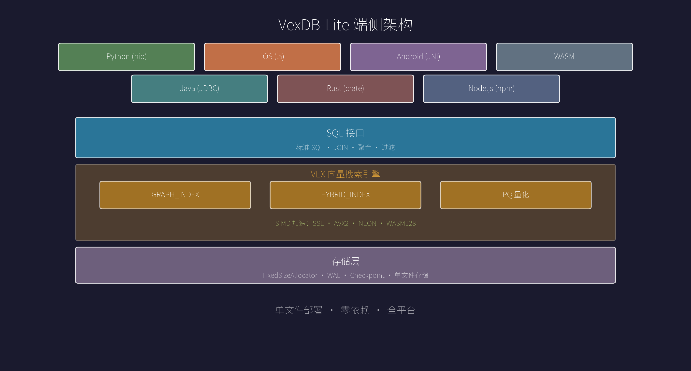
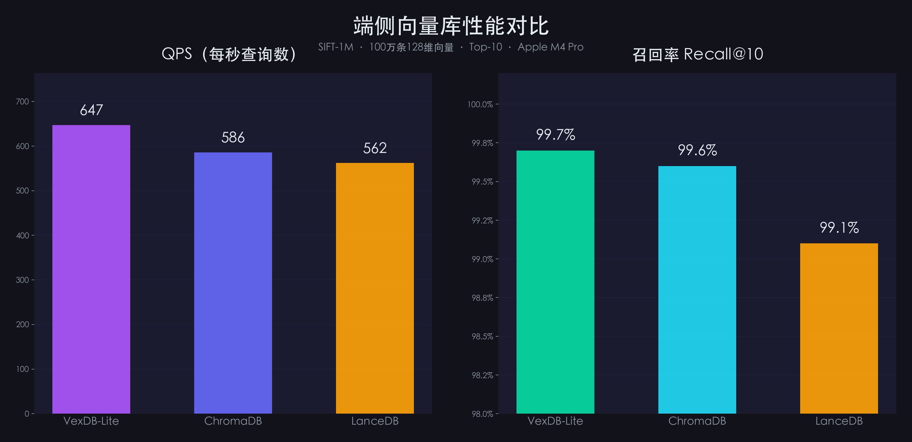
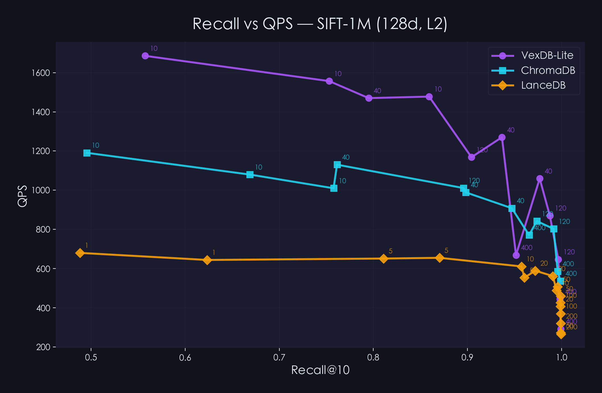

# VexDB支持端侧啦



你有没有想过，在一部手机上、在一台笔记本上，跑一个向量数据库？

不是连云端的那种。是真正跑在本地的、断网也能用的、数据完全不出设备的那种。

今天，VexDB-Lite 正式支持端侧部署。

## 先说说 VexDB-Lite 是什么

VexDB-Lite 是一个嵌入式向量搜索引擎。你可以把它理解为：一个既能做传统关系查询，又天生懂"语义搜索"的嵌入式数据库。

传统数据库擅长精确匹配——你搜"苹果"，它只返回包含"苹果"的结果。但 VexDB-Lite 不同，它能理解"水果"和"苹果"之间的关系，因为它搜索的是向量，不是文本。同时，你依然可以用标准 SQL 做 JOIN、聚合、过滤——关系型的能力一样没少。

更关键的是，它不需要服务器。

没有 Docker，没有集群，没有网络请求。一个文件，就是一个数据库。



## 端侧部署，具体意味着什么

**一个库，三端通吃**

VexDB-Lite 不只是一个 Python 包。它是一个编译好的原生引擎，直接跑在 iOS、Android 和浏览器上：

| 平台 | 集成方式 | 包体积 |
|------|---------|--------|
| Python（桌面/服务器） | `pip install vexdb-lite` | — |
| iOS | `libvexdb.a` 静态库 | **11 MB** |
| Android | `.a` / JNI 集成 | **11 MB** |
| 浏览器 | WebAssembly 模块 | — |

11 MB 包含了完整的 SQL 引擎 + HNSW 向量索引 + PQ 量化。SQLite + sqlite-vec 虽然更小，但 sqlite-vec 只支持暴力 KNN 扫描，没有 HNSW 图索引，十万级数据上就会慢几个数量级。VexDB-Lite 包含完整的列式分析引擎 + 真正可用的 ANN 搜索能力。

不需要起服务，不需要配端口。一个文件就是一个数据库：

```sql
-- 创建向量索引
CREATE INDEX idx ON documents USING GRAPH_INDEX(embedding)
  WITH (metric='cosine', m=16, ef_construction=200);

-- 语义搜索，一条 SQL 搞定
SELECT title, content
FROM documents
ORDER BY cosine_distance(embedding, [0.1, 0.2, ...])
LIMIT 10;
```

**全平台 SIMD 加速**

端侧设备千差万别，VexDB-Lite 对此做了充分适配：

- Intel/AMD 笔记本：SSE + AVX2 指令集加速
- Apple M 系列 / Android 设备：ARM NEON 加速
- 浏览器环境：WebAssembly SIMD128 加速

从笔记本到手机，从边缘设备到浏览器，向量距离计算都能跑在硬件加速通道上。

**移动端专属优化**

不是把桌面版塞进手机，而是从底层适配了移动端的特点：

- 锁实现从自旋锁降级为 mutex，减少 CPU 空转，省电
- 并行构建阈值从 10000 行降到 1000 行，小数据集也能加速
- 单文件静态链接，启动即可用，不需要 `dlopen` 加载扩展

**内存友好的量化压缩**

端侧设备内存有限，这是现实。VexDB-Lite 内置了 PQ 量化能力：

```sql
CREATE INDEX idx ON documents USING GRAPH_INDEX(embedding)
  WITH (quantizer='pq', pq_m=8);
```

一行配置，向量体积压缩 4-8 倍。1 万条 384 维向量含索引约 15 MB，启用 PQ 后可压缩到 2-4 MB。

**数据不出设备**

这可能是端侧部署最重要的价值。

VexDB-Lite 的所有计算都在本地完成——索引构建、向量检索、结果排序，没有任何数据需要发送到外部服务器。对于处理用户隐私数据的场景，这不是"加分项"，而是"必选项"。

## 不只是能跑，还要跑得好

端侧不意味着"阉割版"。VexDB-Lite 在端侧提供的是完整能力：

**两种索引，覆盖主流场景**

- GRAPH_INDEX：基于 HNSW 算法的图索引，适合纯向量近邻搜索
- HYBRID_INDEX：混合索引，支持向量 + 标量联合过滤

这是关系型数据库和向量数据库结合的真正价值。你不需要两套系统，一条 SQL 就能同时做结构化过滤和语义搜索：

```sql
-- 在价格低于100元的商品中，找语义最相似的10个
CREATE INDEX idx ON products USING GRAPH_INDEX(embedding, category);

SELECT name, price
FROM products
WHERE category = '数码'
ORDER BY cosine_distance(embedding, [0.1, 0.2, ...])
LIMIT 10;
```

**三种距离度量**

L2 欧氏距离、Cosine 余弦相似度、Inner Product 内积——覆盖主流 Embedding 模型的需求。Cosine 模式下，VexDB-Lite 会自动归一化向量，省去预处理步骤。

**向量去重**

实际业务中，重复向量很常见。VexDB-Lite 支持自动去重，相同向量只建一个图节点，多个 row_id 挂载其上。索引更小，检索更快：

```sql
CREATE INDEX idx ON documents USING GRAPH_INDEX(embedding)
  WITH (max_dedup=8);
```

**并行索引构建**

数据量大的时候，单线程建索引太慢。VexDB-Lite 支持多线程并行构建：

```sql
CREATE INDEX idx ON documents USING GRAPH_INDEX(embedding)
  WITH (threads=8);
```

在万级数据上，8 线程构建速度提升显著。

## 哪些场景适合端侧向量搜索

说几个我们认为最有价值的方向：

**本地知识库助手**。在笔记本上跑一个 RAG 应用，文档 Embedding 存在 VexDB-Lite 里，配合本地 LLM，完全离线的智能问答。

**移动端语义搜索**。相册按语义搜图、聊天记录智能检索、本地推荐系统——不依赖网络，体验更快，隐私更好。

**IoT 与边缘计算**。工业设备的异常检测、传感器数据的模式匹配，在边缘节点就地完成，不用回传云端。

**企业私有化部署**。对数据安全要求高的企业，VexDB-Lite 可以部署在内网机器上，没有外部依赖，审计和合规更简单。

## 端侧实测：五款嵌入式向量库横评

光说不练不行。我们用标准 ANN benchmark 数据集，在同一台笔记本上对几款主流嵌入式向量库做了对比测试。

**测试环境**

- 硬件：Apple MacBook Pro，M4 Pro 芯片，48GB 内存
- 数据集：SIFT-1M（100 万条 128 维向量，L2 距离，标准 ANN benchmark 数据集）
- 测试时长：15 秒持续查询 × 3 轮取最佳，返回 Top-10 近邻
- HNSW 索引统一参数：m=16，ef_construction=64
- 表中数据取各引擎在召回率 ≥ 98.5% 条件下的最高 QPS

**参测选手**

- VexDB-Lite：pip install vexdb-lite，HNSW 索引，SQL 接口
- ChromaDB：pip install chromadb（v0.6.3），当前最流行的嵌入式向量库
- LanceDB：pip install lancedb（v0.30.0），磁盘优先的向量库，IVF_FLAT 索引

**测试结果**



| 指标 | VexDB-Lite | ChromaDB | LanceDB |
|------|-----------|----------|---------|
| 索引类型 | HNSW (m=32, ef_c=128) | HNSW (M=32, ef_c=128) | IVF_FLAT (256 分区) |
| 查询参数 | ef_search=120 | ef_search=400 | nprobes=20 |
| 数据导入 | 0.9 秒 | 509 秒 | 0.5 秒 |
| 索引构建 | 166 秒 | 自动（含在导入中） | 3 秒 |
| 召回率 Recall@10 | 99.7% | 99.6% | 99.1% |
| QPS | 647 | 586 | 562 |
| 平均查询延迟 | 1.5 毫秒 | 1.7 毫秒 | 1.8 毫秒 |
| 索引大小 | 992 MB | 927 MB | 992 MB |
| SQL 查询 | 支持 | 不支持 | 不支持 |
| 混合过滤 | 原生支持 | 元数据过滤 | 支持 |
| 索引持久化 | 支持 | 支持 | 支持 |

我们还测试了多组构建参数（m=8/16/32）和查询参数（ef_search=10~400、nprobes=1~200）下的 Recall-QPS 曲线：



**VexDB-Lite 在 Recall-QPS 曲线上始终占据右上角**——同等召回率下吞吐最高。这得益于 HNSW 图索引在 128 维数据上的优势：图遍历只访问少量节点，每个节点仅 512 字节，CPU 缓存命中率高。稳定性方面，VexDB-Lite 的最大查询延迟控制在 153ms 以内，而 ChromaDB 偶尔会出现超过 500ms 的毛刺。

几个值得关注的点：

**ChromaDB 是目前最流行的嵌入式向量库**。底层同样使用 HNSW 算法，但导入 100 万条数据需要 364 秒，VexDB-Lite 只要 0.9 秒——快了 400 倍。原因是 VexDB-Lite 通过 PyArrow 零拷贝批量导入，而 ChromaDB 逐批 add() 需要 Python 层序列化。

**LanceDB 导入和索引构建最快**（总计 3.5 秒），但不支持纯 HNSW 索引。其 IVF_FLAT 索引在高召回区间 QPS 下降明显（nprobes 越大越慢），而 HNSW 在高召回时 QPS 衰减更平缓。

**这组数据想说明的是**：端侧向量搜索不是把服务端数据库缩小就行，也不是只有一个向量检索算法就够。它需要在轻量级引擎、高效数据导入、完整查询能力之间找到平衡。VexDB-Lite 的定位就是这个平衡点。

## 质量经得起检验

VexDB-Lite 目前通过了 86 个测试用例、4147 个断言，覆盖：

- 基础的增删改查
- 多种距离度量的正确性
- 并发读写的安全性
- 删除后召回率的稳定性（2000 行和 10000 行大规模验证）
- 序列化与反序列化的完整性

这不是一个 Demo，是一个经过严肃测试的工程实现。

## 写在最后

端侧 AI 的拼图一直缺一块：本地向量存储。

云端方案成熟、好用，但不是所有场景都适合把数据送上云。当 AI 推理已经能跑在手机上的时候，向量检索没理由还留在服务器里。

VexDB-Lite 支持端侧，不是为了追概念，而是因为这件事本来就该这么做。

欢迎试用，欢迎反馈。

PyPI 安装：pip install vexdb-lite（即将发布，敬请期待）
